 [index .html](https://github.com/user-attachments/files/25514542/index.html)
<!DOCTYPE html>[style.css](https://github.com/user-attachments/files/25515107/style.css)*{
margin:0;
padding:0;
box-sizing:border-box;
font-family:'Segoe UI',sans-serif;
}

body{
background:#f5f7fa;
color:#338645;
line-height:1.7;
}

header{
display:flex;
justify-content:space-between;
align-items:center;
padding:15px 10%;
background:#0f2027;
color:rgb(43, 102, 132);
}

.lang-switch button{
margin-left:5px;
padding:6px 10px;
border:none;
background:#00c3ff;
color:white;
cursor:pointer;
border-radius:5px;
}

.hero{
height:80vh;
background:linear-gradient(rgba(0,0,0,0.5),rgba(0,0,0,0.5)),
url(images/0.jpeg) center/cover;
color:white;
display:flex;
flex-direction:column;
justify-content:center;
align-items:center;
text-align:center;
}

.hero h1{
font-size:45px;
margin-bottom:10px;
}

.section{
padding:60px 10%;
text-align:center;
}

.bg-light{
background:#eef2f7;
}

.cards{
display:grid;
grid-template-columns:repeat(auto-fit,minmax(250px,1fr));
gap:20px;
margin-top:30px;
}

.card{
background:rgba(71, 119, 86, 0);
padding:20px;
border-radius:10px;
box-shadow:0 5px 15px rgba(54, 51, 51, 0.1);
transition:0.3s;
}

.card:hover{
transform:translateY(-10px);
}

form{
display:flex;
flex-direction:column;
gap:15px;
max-width:400px;
margin:auto;
}

input,textarea{
padding:10px;
border-radius:8px;
border:1px solid #ccc;
}

button{
padding:12px;
border:none;
background:#2c5364;
color:white;
border-radius:8px;
cursor:pointer;
}
/* Gallery */
.gallery h3{
margin-top:40px;
margin-bottom:15px;
}

.gallery-grid{
display:grid;
grid-template-columns:repeat(auto-fit,minmax(200px,1fr));
gap:15px;
}

.gallery-grid img{
width:100%;
height:200px;
object-fit:cover;
border-radius:10px;
cursor:pointer;
transition:0.3s;
}

.gallery-grid img:hover{
transform:scale(1.05);
}

/* Lightbox */
#lightbox{
display:none;
position:fixed;
top:0;
left:0;
width:100%;
height:100%;
background:rgba(0,0,0,0.8);
justify-content:center;
align-items:center;
z-index:1000;
}

#lightbox img{
max-width:80%;
max-height:80%;
border-radius:10px;
}
button:hover{
background:#1c3b4a;
}

footer{
background:#111827;
color:white;
text-align:center;
padding:20px;
margin-top:40px;
}

@media(max-width:768px){
.hero h1{font-size:30px;}
header{flex-direction:column;}
}

<html lang="ar">
<head>
<meta charset="UTF-8">
<meta name="viewport" content="width=device-width, initial-scale=1.0">
<title>سياحة تامشكط | Tamchekett Tourism</title>
<!-- SEO Meta Tags -->
<meta name="description" content="موقع سياحي شامل عن تامشكط في ولاية الحوض الغربي - تاريخ، قرى، آثار، زراعة وسياحة في موريتانيا.">
<meta name="keywords" content="تامشكط, سياحة تامشكط, الحوض الغربي, موريتانيا, قرى تامشكط, بلديات تامشكط">
<meta name="author" content="ZEINE">

<!-- Google Verification (تضيفه لاحقاً من Search Console) -->
<meta name="google-site-verification" content="ضع-الكود-هنا">

<!-- Open Graph (مهم عند مشاركة الرابط في فيسبوك) -->
<meta property="og:title" content="سياحة تامشكط - Tamchekett Tourism">
<meta property="og:description" content="اكتشف التاريخ العريق والقرى والبلديات التابعة لتامشكط في موريتانيا">
<meta property="og:image" content="https://username.github.io/tamchekett-tourism/images/cover.jpg">
<meta property="og:type" content="website">
<meta name="robots" content="index, follow">
<meta http-equiv="X-UA-Compatible" content="IE=edge">
<link rel="icon" href="images/favicon.png">
<link rel="stylesheet" href="style.css">
</head>
<body>

<header>
    
🌍 Tamchekett Tourism

    

        <button onclick="setLang('ar')">العربية</button>
        <button onclick="setLang('fr')">Français</button>
    

</header>

<section class="hero">
    <h1 data-ar="اكتشف تامشكط" 
        data-fr="Découvrez Tamchekett">
        اكتشف تامشكط
    </h1>
    

       مدينة التاريخ والصحراء العريقة
    

</section>

<section class="section">
<h2 data-ar="نبذة عامة" data-fr="Présentation">نبذة عامة</h2>

تقع تامشكط في ولاية الحوض الغربي جنوب شرق موريتانيا، ويبلغ عدد سكانها حوالي 44 ألف نسمة موزعين على خمس بلديات.

</section>

<section class="section bg-light">
<h2 data-ar="الأهمية التاريخية" data-fr="Importance historique">الأهمية التاريخية</h2>
<ul>
<li>من أقدم المستوطنات الصحراوية في الصحراء الكبرى.</li>
<li>مركز تجاري خلال العصور الحديدية (2000 ق.م – 500 م).</li>
<li>تشتهر بالقرى الحجرية والمساجد الطينية.</li>
<li>جزء من طرق التجارة بين شمال وغرب إفريقيا.</li>
</ul>
</section>

<section class="section">
<h2 data-ar="البلديات التابعة" data-fr="Communes">البلديات التابعة</h2>

<h3>بلدية تامشكط</h3> 

المركز الإداري والتاريخي للمقاطعة

<!-- نافذة تكبير الصورة -->

<!--تامشكط -->

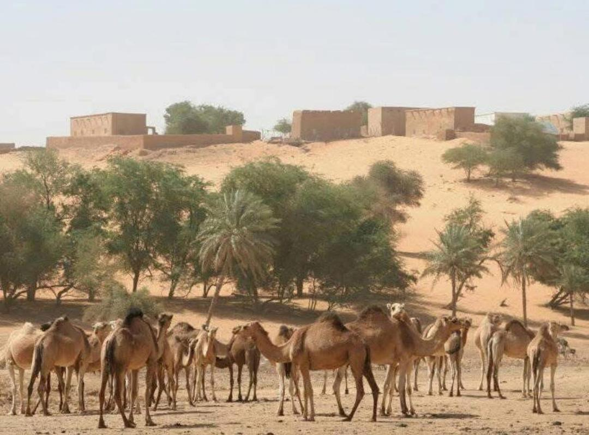
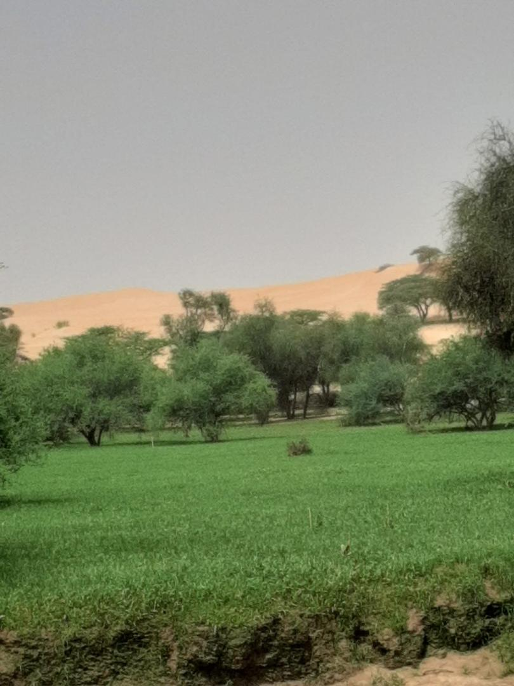

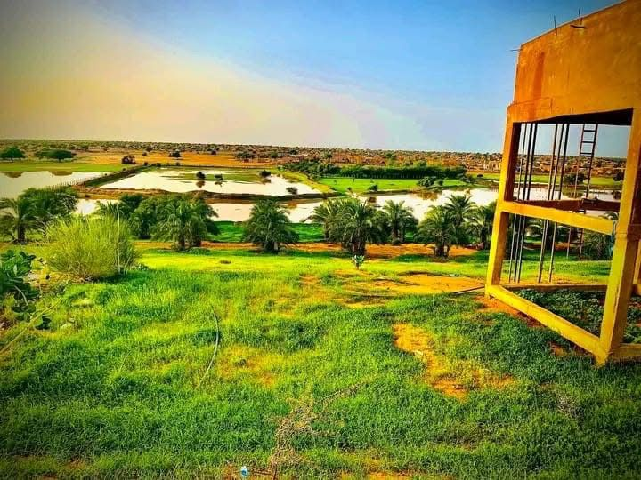

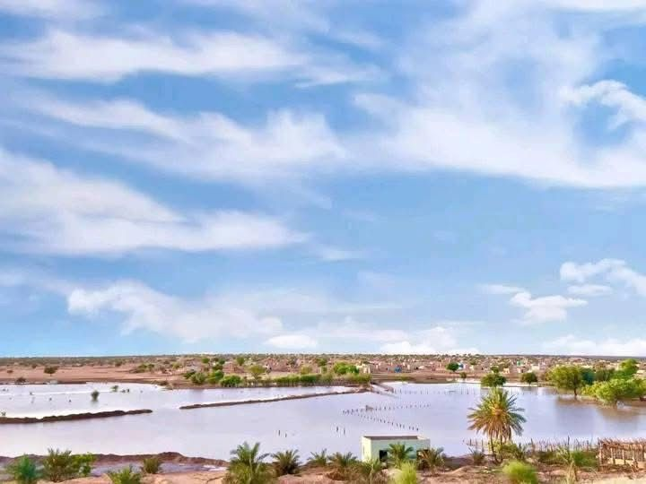

<h3>بلدية المبروك</h3>

المبروك – أفجار – تجمعات رعوية موسمية

<!-- نافذة تكبير الصورة -->

<!-- المبروك -->
<h3>بلدية المبروك</h3>

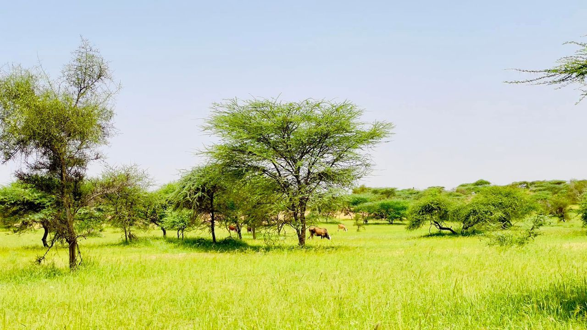

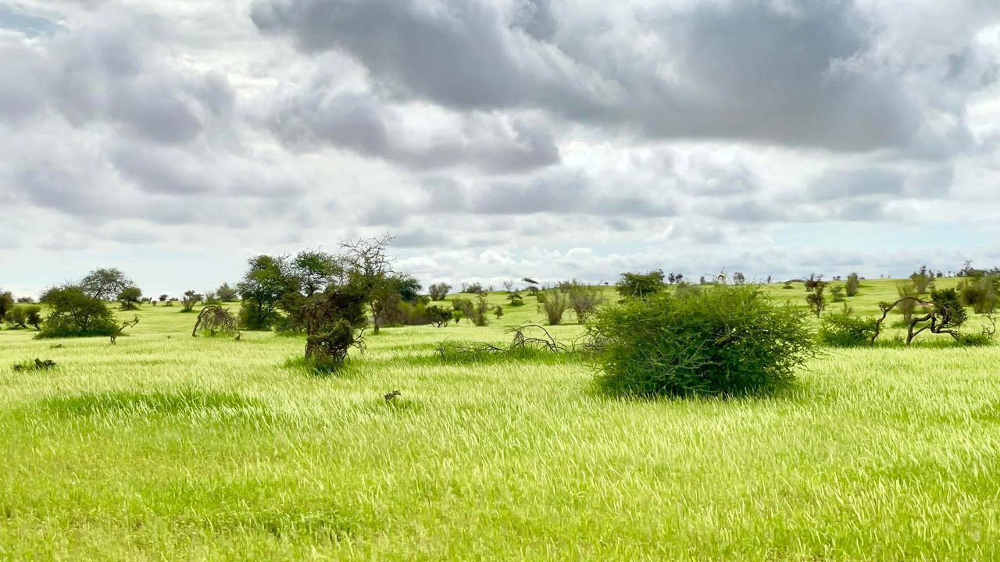
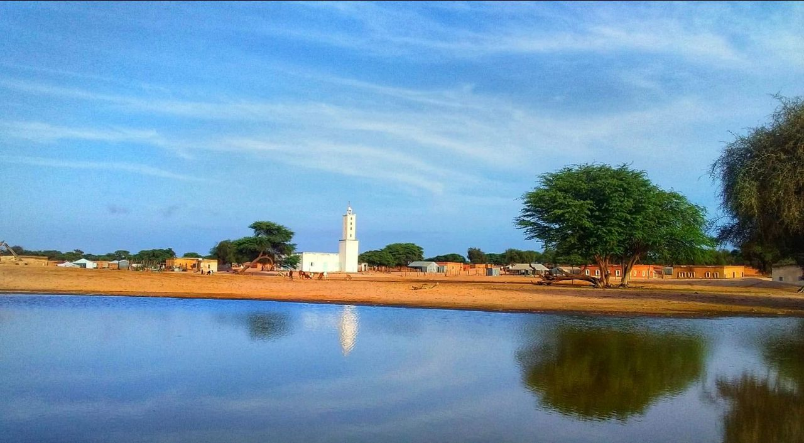
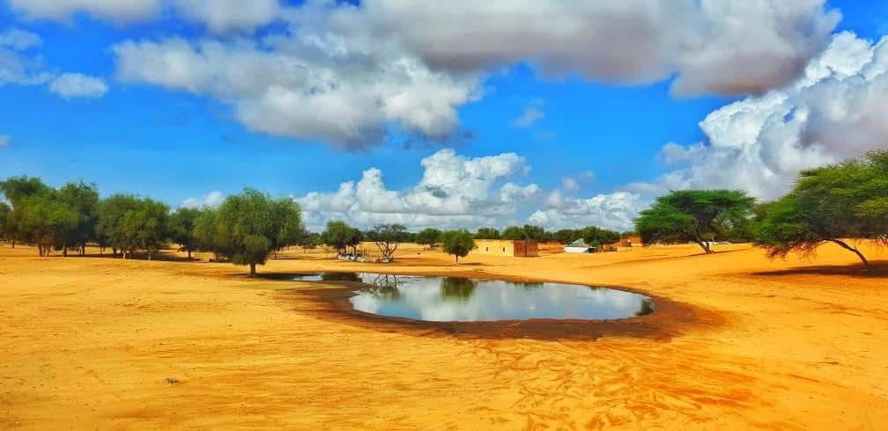
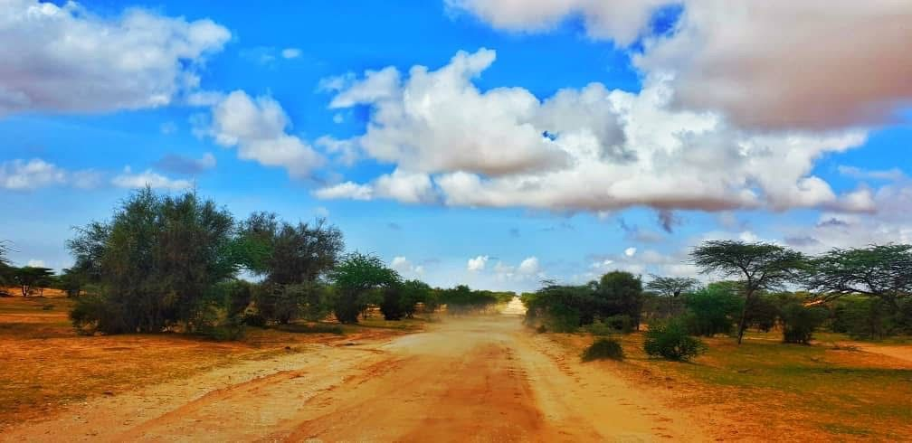
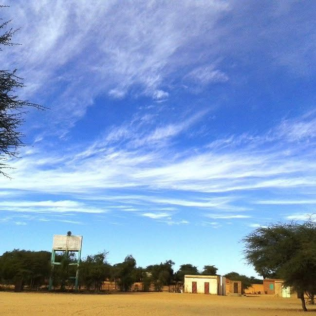

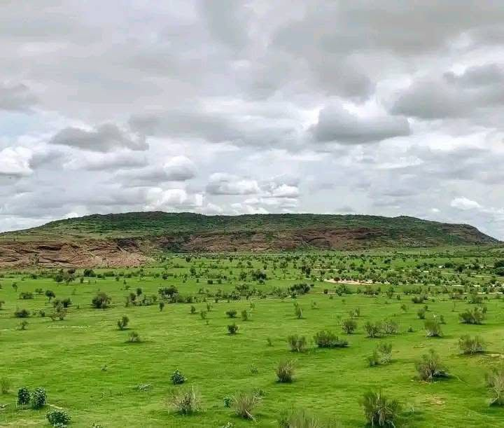
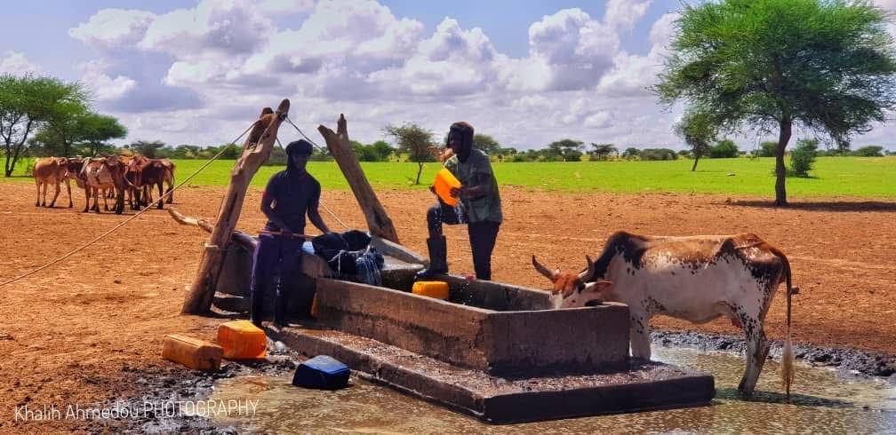

<h3>بلدية الراظي</h3>

الراظي – الحرشة – آكرج – آرشان – نيشان – المفكع – القليب – أودي اللوت

<!-- نافذة تكبير الصورة -->

<!-- الراظي -->

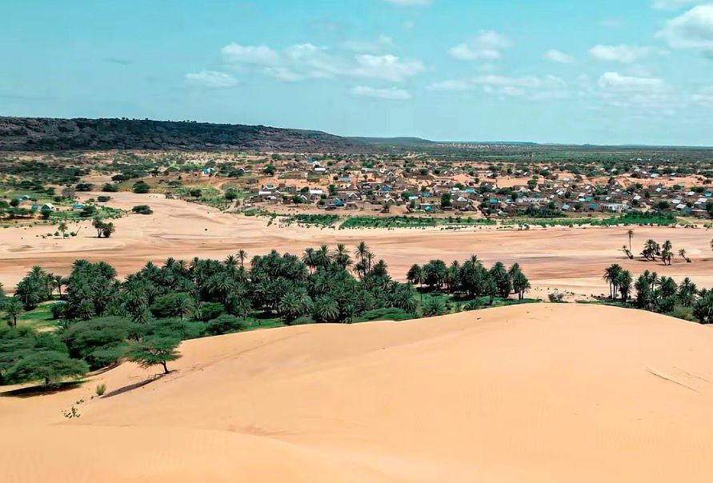
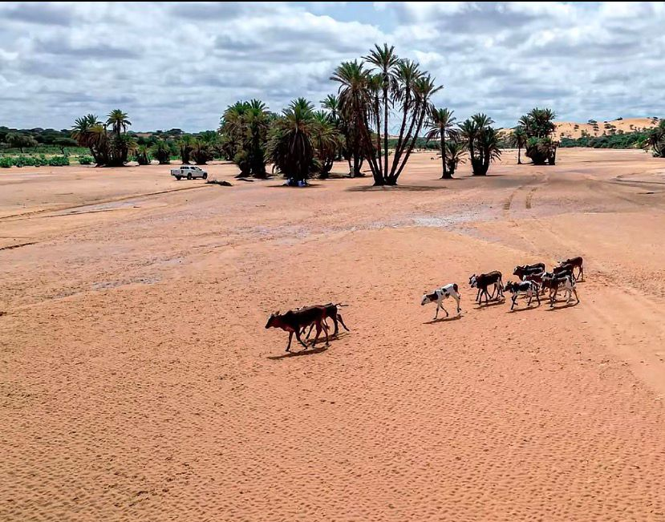
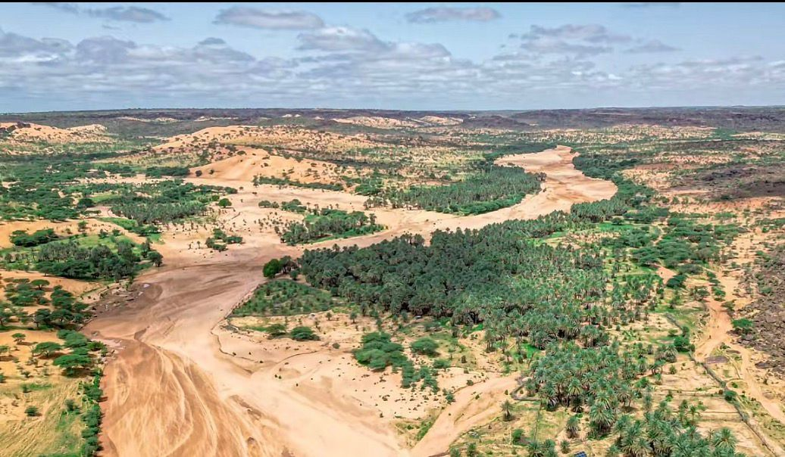

<h3>بلدية الصفا</h3>

الصفا – اغليك أولاد مالك – تويجيريت – انصفني – كاعت التيدوم – الفوز – بدر

<!-- نافذة تكبير الصورة -->

<!-- الصفا -->

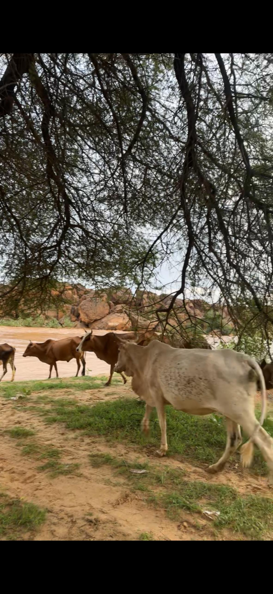
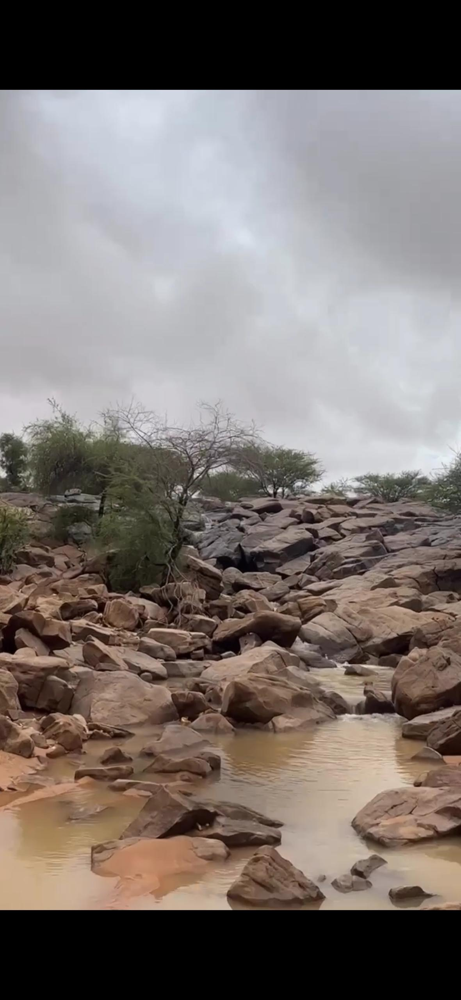

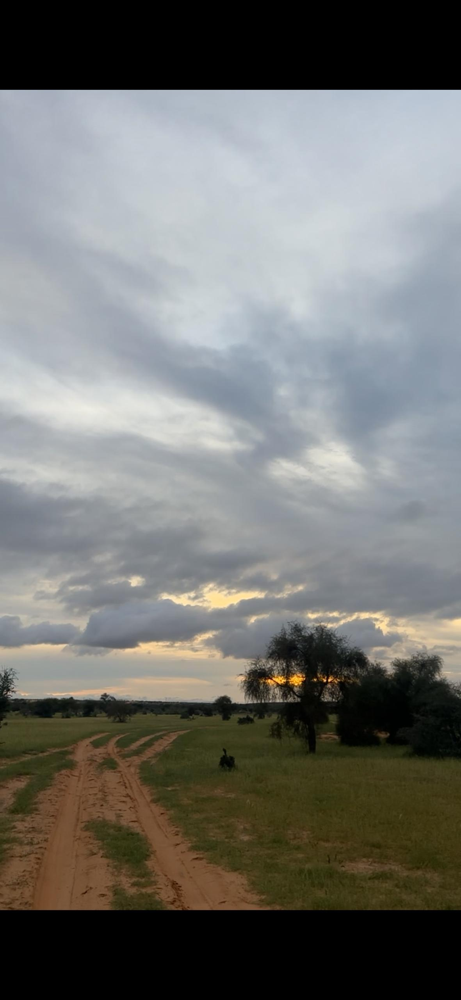

<h3>بلدية كاعت التيدومة</h3>

كاعت التيدومة – لكراير – امريميدة – أودي لوت

<!-- نافذة تكبير الصورة -->

<!-- كاعت التيدومة -->
<h3>بلدية كاعت التيدومة</h3>

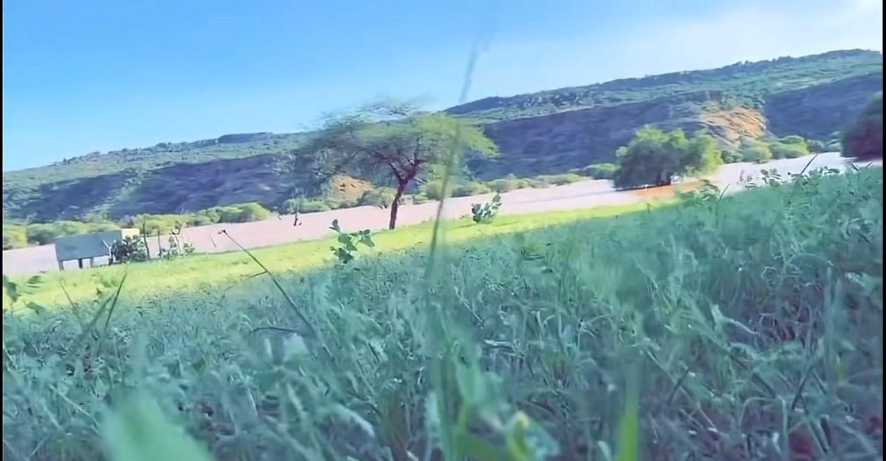

<section class="section bg-light">
<h2 data-ar="الزراعة والتجارة" data-fr="Agriculture et commerce">الزراعة والتجارة</h2>

تعتمد المنطقة على الزراعة المطرية وتربية الماشية، وكانت جزءاً مهماً من طرق التجارة التاريخية بين شمال ووسط إفريقيا.

</section>

<section class="section">
<h2 data-ar="تواصل معنا" data-fr="Contactez-nous">تواصل معنا</h2>
<form>
<input type="text" placeholder="الاسم / Nom" required>
<input type="email" placeholder="البريد الإلكتروني / Email" required>
<textarea placeholder="رسالتك / Votre message"></textarea>
<button type="submit">إرسال</button>
</form>
</section>

<footer>
© 2026 Tamchekett Tourism | Designed by NASSRALLA ZEINE
</footer>

</body>
</html>
